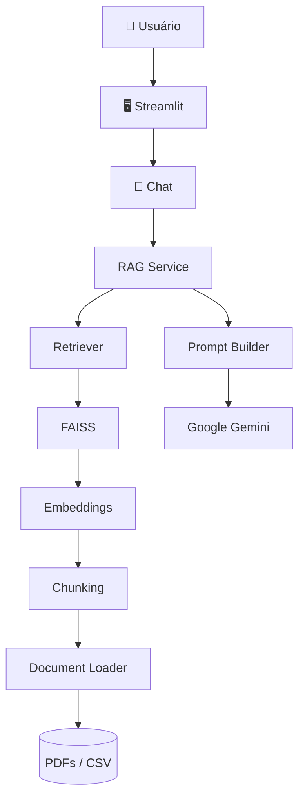

# 🎓 EduAgent AI

> Agente Inteligente para Atendimento Educacional utilizando IA Generativa e RAG (Retrieval-Augmented Generation).


---

## 📌 Sobre este repositório

Este projeto está sendo desenvolvido de forma incremental durante a **Formação de Agentes de IA da Alura**.

Cada Sprint representa uma etapa da construção da solução, desde a definição da arquitetura até a implementação de um agente inteligente baseado em **RAG (Retrieval-Augmented Generation)**, utilizando boas práticas de Engenharia de Software, Inteligência Artificial e desenvolvimento de aplicações Python.

Além de atender aos requisitos do desafio, este repositório documenta toda a evolução do projeto, incluindo decisões arquiteturais, aprendizados, documentação técnica e boas práticas adotadas durante o desenvolvimento.

---

## 📖 Sobre o Projeto

O **EduAgent AI** é uma plataforma inteligente desenvolvida para responder perguntas em linguagem natural com base na documentação de uma instituição de ensino.

A aplicação utiliza técnicas de **RAG (Retrieval-Augmented Generation)** para localizar informações relevantes em documentos institucionais, permitindo que estudantes obtenham respostas rápidas sobre regulamentos, bolsas, certificados, políticas acadêmicas, perguntas frequentes e demais conteúdos oficiais.

O projeto foi concebido para servir como base de uma plataforma escalável de atendimento educacional, separando responsabilidades em módulos independentes para facilitar manutenção, testes e evolução da aplicação.

---

## 🔮 Visão do Projeto

O EduAgent AI nasce como solução para o desafio final da Formação de Agentes de IA da Alura.

Após a conclusão do desafio, a arquitetura será expandida para atender um cenário real de negócio, evoluindo para uma plataforma inteligente destinada a instituições de ensino e cursos online.

Entre as evoluções planejadas estão:

- 🌐 Landing Page institucional
- 🎓 Plataforma de ensino online
- 🤖 Assistente inteligente baseado em IA
- 📄 Consulta inteligente à documentação institucional utilizando RAG
- 💬 Atendimento integrado ao Website
- 📱 Integração com WhatsApp
- ✈️ Integração com Telegram
- 🔄 Automação de processos utilizando n8n
- 📊 Painel administrativo para gestão da plataforma

---

## 📚 Jornada de Aprendizado

Este projeto faz parte da minha jornada de estudos em **Engenharia de Inteligência Artificial**.

Durante seu desenvolvimento estou consolidando conhecimentos em:

- 🐍 Arquitetura de aplicações Python
- 🏗️ Arquitetura modular e organização de projetos
- 🤖 Desenvolvimento de Agentes de IA
- 🔗 LangChain
- 📚 RAG (Retrieval-Augmented Generation)
- ✍️ Engenharia de Prompts
- 🧩 Processamento e segmentação de documentos (Chunking)
- 🧠 Embeddings e Busca Semântica
- 🗄️ Bancos Vetoriais (FAISS)
- 💬 Integração com LLMs (Google Gemini)
- 🎨 Desenvolvimento de interfaces com Streamlit
- ⚙️ Engenharia de Software e Clean Architecture
- ☁️ Deploy de aplicações na Oracle Cloud Infrastructure (OCI)
- 🔄 Automação de fluxos com n8n (próximas etapas)

## 🎯 Objetivos

- Construir um agente utilizando LangChain
- Implementar um pipeline completo de RAG
- Utilizar um banco vetorial (FAISS)
- Integrar o Gemini
- Criar uma interface utilizando Streamlit
- Implantar na Oracle Cloud (OCI)
- Evoluir para uma plataforma educacional inteligente

## 🏗️ Arquitetura Atual

```text
                       👤 Usuário
                             │
                             ▼
                  ┌──────────────────────┐
                  │   🚀 app.py          │
                  │ Ponto de Entrada     │
                  └──────────┬───────────┘
                             │
                             ▼
                  ┌──────────────────────┐
                  │ 🖥️ Streamlit UI       │
                  │ Interface Principal  │
                  └──────────┬───────────┘
                             │
                             ▼
                  ┌──────────────────────┐
                  │ 🧩 Componentes UI     │
                  │ Página • Sidebar     │
                  └──────────┬───────────┘
                             │
                             ▼
                  ┌──────────────────────┐
                  │ ⚙️ Configurações      │
                  │ settings.py          │
                  └──────────┬───────────┘
                             │
                             ▼
                  ┌──────────────────────┐
                  │ 📦 Estrutura Modular  │
                  │ src/eduagent         │
                  └──────────────────────┘
```

## 🔮 Arquitetura Final



## 🚀 Tecnologias

- Python 3.13
- Streamlit
- LangChain
- Google Gemini
- FAISS
- Pydantic
- python-dotenv
- PyPDF
- Pandas
- Git
- GitHub

## 📁 Estrutura do Projeto

```text
eduagent-ia/
│
├── docs/                  # Documentação técnica
├── src/                   # Código-fonte da aplicação
│   └── eduagent/
│       ├── config/        # Configurações
│       ├── embeddings/    # Geração de embeddings
│       ├── loaders/       # Leitura de documentos
│       ├── prompts/       # Templates de prompts
│       ├── retrievers/    # Recuperação de contexto
│       ├── services/      # Regras de negócio
│       ├── splitters/     # Divisão de documentos
│       ├── ui/            # Interface Streamlit
│       ├── utils/         # Funções auxiliares
│       └── vectorstore/   # Banco vetorial
│
├── app.py                 # Ponto de entrada da aplicação
├── requirements.txt       # Dependências
├── README.md              # Documentação principal
└── .gitignore
```

## ✅ Funcionalidades

- [x] Estrutura do projeto
- [x] Configuração centralizada
- [x] Interface inicial
- [x] Sidebar
- [ ] Loader PDF
- [ ] Splitter
- [ ] Embeddings
- [ ] Banco Vetorial
- [ ] Retriever
- [ ] Chat
- [ ] Memória
- [ ] Deploy OCI

## 🛣️ Roadmap

Sprint 1 ✅ Ambiente

Sprint 2 ✅ Arquitetura

Sprint 3 ✅ GitHub

Sprint 4 🔄 Interface

Sprint 5 ⏳ Loader

Sprint 6 ⏳ Chunking

Sprint 7 ⏳ Embeddings

Sprint 8 ⏳ FAISS

Sprint 9 ⏳ Retriever

Sprint 10 ⏳ RAG

Sprint 11 ⏳ Deploy

## 📋 Pré-requisitos

Antes de iniciar, certifique-se de possuir:

- Python 3.13+
- Git
- Conta Google AI Studio
- Chave da API do Gemini
- VS Code (recomendado)

## 🚀 Como executar

### 1️⃣ Clonar o repositório

```bash
git clone https://github.com/dfarneym/eduagent-ia.git
```

### 2️⃣ Acessar a pasta do projeto

```bash
cd eduagent-ia
```

### 3️⃣ Criar o ambiente virtual

```bash
python -m venv .venv
```

### 4️⃣ Ativar o ambiente virtual

**Windows (PowerShell)**

```powershell
.\.venv\Scripts\Activate.ps1
```

**Windows (CMD)**

```cmd
.venv\Scripts\activate.bat
```

**Linux / macOS**

```bash
source .venv/bin/activate
```

### 5️⃣ Instalar as dependências

```bash
pip install -r requirements.txt
```

### 6️⃣ Configurar as variáveis de ambiente

Crie um arquivo `.env` na raiz do projeto:

```env
GOOGLE_API_KEY=sua_chave_api
```

### 7️⃣ Executar a aplicação

```bash
streamlit run app.py
```

Após a inicialização, acesse:

```text
http://localhost:8501
```

## 🔮 Evolução do projeto

Após concluir o desafio, a arquitetura será expandida para:

- Plataforma completa de ensino de Espanhol
- Landing Page
- Área do aluno
- Chat inteligente
- Integração WhatsApp
- Integração Telegram
- N8N
- Dashboard Administrativo

## 👨‍💻 Autor

Daniel Farney

Engenheiro de IA Jr. | Dados | Python | IA Generativa

LinkedIn

GitHub