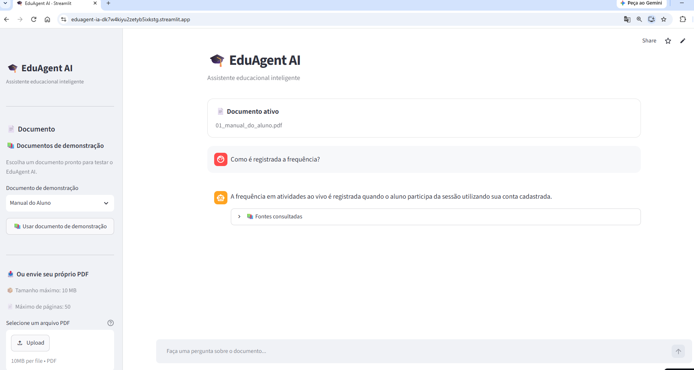
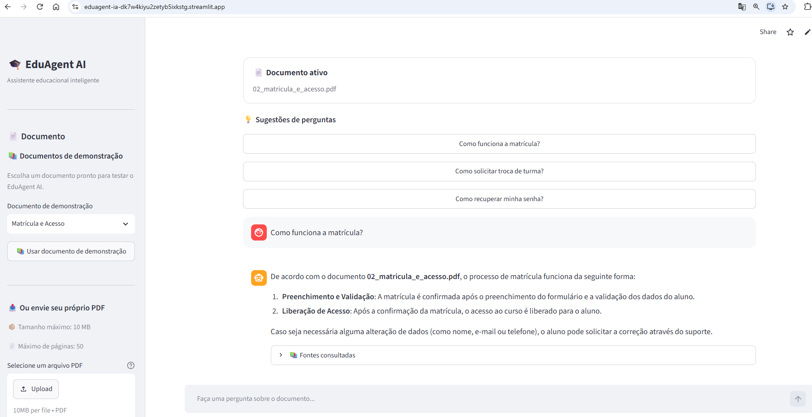
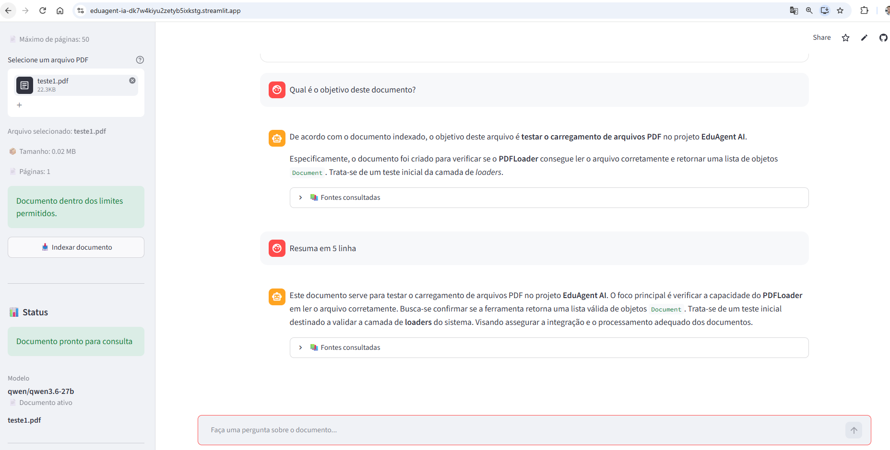

# 🎓 EduAgent AI


---
## 📌 Sobre este repositório

Este projeto está sendo desenvolvido de forma incremental durante a **Formação de Agentes de IA da Alura**.

Cada Sprint representa uma etapa da construção da solução, desde a definição da arquitetura até a implementação de um agente inteligente baseado em **RAG (Retrieval-Augmented Generation)**, utilizando boas práticas de Engenharia de Software, Inteligência Artificial e desenvolvimento de aplicações Python.

Além de atender aos requisitos do desafio, este repositório documenta toda a evolução do projeto, incluindo decisões arquiteturais, aprendizados, documentação técnica e boas práticas adotadas durante o desenvolvimento.

---

## 📖 Sobre o Projeto

O **EduAgent AI** é uma plataforma inteligente desenvolvida para responder perguntas em linguagem natural com base na documentação de uma instituição de ensino.

A aplicação utiliza técnicas de **RAG (Retrieval-Augmented Generation)** para localizar informações relevantes em documentos institucionais, permitindo que estudantes obtenham respostas rápidas sobre regulamentos, bolsas, certificados, políticas acadêmicas, perguntas frequentes e demais conteúdos oficiais.

O projeto foi concebido para servir como base de uma plataforma escalável de atendimento educacional, separando responsabilidades em módulos independentes para facilitar manutenção, testes e evolução da aplicação.

---

## 🔮 Visão do Projeto

O EduAgent AI nasce como solução para o desafio final da Formação de Agentes de IA da Alura.

Após a conclusão do desafio, a arquitetura será expandida para atender um cenário real de negócio, evoluindo para uma plataforma inteligente destinada a instituições de ensino e cursos online.

Entre as evoluções planejadas estão:

- 🌐 Landing Page institucional
- 🎓 Plataforma de ensino online
- 🤖 Assistente inteligente baseado em IA
- 📄 Consulta inteligente à documentação institucional utilizando RAG
- 💬 Atendimento integrado ao Website
- 📱 Integração com WhatsApp
- ✈️ Integração com Telegram
- 🔄 Automação de processos utilizando n8n
- 📊 Painel administrativo para gestão da plataforma

---

A solução permite consultar documentos educacionais e obter respostas baseadas
no conteúdo disponível, evitando que o agente responda utilizando informações
que não estejam presentes no documento consultado.

## ✨ Funcionalidades

- 📄 Upload de documentos PDF
- 📚 Documentos de demonstração incluídos no projeto
- 🔍 Recuperação de informações utilizando RAG
- 🧠 Busca semântica
- 💬 Interface conversacional com Streamlit
- 📑 Indicação das fontes consultadas
- 💡 Sugestões de perguntas relacionadas ao documento
- 📦 Validação do tamanho do arquivo
- 📄 Validação da quantidade de páginas
- 🐳 Execução através de Docker

## 📏 Limites atuais

Para manter o processamento adequado da aplicação:

- **Tamanho máximo:** 10 MB por arquivo
- **Quantidade máxima:** 50 páginas por documento

A interface informa ao usuário o tamanho e a quantidade de páginas do arquivo
antes da indexação.

## 📚 Documentos de demonstração

O projeto disponibiliza documentos educacionais de demonstração para que a
aplicação possa ser testada imediatamente, sem necessidade de preparar ou
enviar um documento próprio.

Os documentos estão disponíveis em:

`data/demo/`

Incluem:

1. Manual do Aluno
2. Matrícula e Acesso
3. Bolsas e Benefícios
4. Avaliações e Recuperação
5. Certificados
6. Calendário Acadêmico
7. Financeiro e Pagamentos
8. Suporte e FAQ

Na interface, selecione **Documentos de demonstração** e escolha um dos documentos disponíveis.

## 🧠 Arquitetura 
                   👤 Usuário
                         │
                         ▼
                ┌─────────────────┐
                │    Streamlit    │
                │   Interface UI  │
                └────────┬────────┘
                         │
                         ▼
                ┌─────────────────┐
                │   Documento PDF │
                └────────┬────────┘
                         │
                         ▼
                ┌─────────────────┐
                │   PDF Loader    │
                └────────┬────────┘
                         │
                         ▼
                ┌─────────────────┐
                │    Chunking     │
                └────────┬────────┘
                         │
                         ▼
                ┌─────────────────┐
                │    Embeddings   │
                └────────┬────────┘
                         │
                         ▼
                ┌─────────────────┐
                │      FAISS      │
                │ Vector Store    │
                └────────┬────────┘
                         │
                         ▼
                ┌─────────────────┐
                │    Retriever    │
                └────────┬────────┘
                         │
                         ▼
                ┌─────────────────┐
                │   Agente / LLM  │
                └────────┬────────┘
                         │
                         ▼
                💬 Resposta + fonte
---

## 🧪 Teste rápido

A aplicação oferece duas formas de teste:

- selecionar um dos documentos de demonstração disponíveis na interface;
- enviar um PDF próprio pelo botão de upload.

Para uma avaliação rápida, recomenda-se utilizar primeiro um dos documentos
de demonstração.

### 📚 Teste com documento de demonstração

1. Abra a aplicação.
2. Expanda **Documentos de demonstração**.
3. Selecione um documento.
4. Aguarde a indexação.
5. Utilize uma das perguntas sugeridas.
6. Faça perguntas adicionais sobre o conteúdo.
7. Consulte as fontes apresentadas nas respostas.

### Exemplos de perguntas

Use perguntas relacionadas ao conteúdo do documento, por exemplo:

```text
Qual é o objetivo deste documento?

Qual componente é responsável por isso?

E o que ele deve retornar?

Explique esse componente com mais detalhes.

Resuma o documento.
```

### Teste de conhecimento externo

Também é possível testar a regra de contenção do agente:

```text
Qual é a capital do Brasil?
```

Quando essa informação não estiver presente no documento, o agente deve informar que ela não foi encontrada nos documentos disponíveis.

### Teste de contexto

Faça uma sequência como:

```text
Qual é o objetivo deste documento?
```

Depois:

```text
Qual componente é responsável por isso?
```

E:

```text
Explique esse componente com mais detalhes.
```

A segunda e a terceira pergunta devem utilizar o contexto da conversa anterior, mas continuar consultando o documento por meio do RAG.

---

## 🔎 Fluxo de processamento

1. O usuário envia um PDF pela interface.
2. O arquivo é salvo temporariamente para processamento.
3. O loader extrai o conteúdo.
4. O conteúdo é dividido em trechos.
5. São gerados embeddings.
6. Os embeddings são indexados no FAISS.
7. O usuário faz uma pergunta.
8. O agente utiliza `search_documents`.
9. O RAG recupera os trechos mais relevantes.
10. O modelo gera a resposta usando o contexto recuperado.
11. As fontes consultadas são apresentadas na interface.

---

## 🛠️ Tecnologias utilizadas

| Camada | Tecnologia |
|---|---|
| Linguagem | Python 3.13 |
| Interface | Streamlit |
| Agentes | LangGraph |
| Orquestração | LangChain |
| LLM | Groq + Qwen |
| Embeddings | Sentence Transformers |
| Busca vetorial | FAISS |
| Leitura de PDF | PyPDF |
| Configuração | Pydantic Settings |
| Variáveis de ambiente | python-dotenv |
| Containerização | Docker |
| Versionamento | Git / GitHub |

---

## 📄 Formatos de documentos

### Suporte atual

- [x] PDF

### Evolução planejada

- [ ] Word (`.docx`)
- [ ] Excel (`.xlsx`)
- [ ] PowerPoint (`.pptx`)
- [ ] Markdown (`.md`)
- [ ] CSV
- [ ] JSON
- [ ] HTML

> O suporte aos demais formatos faz parte da evolução planejada para atender integralmente ao escopo proposto pelo challenge.

---
````
## 📁 Estrutura do projeto

eduagent-ia/
│
├── data/
│   └── demo/                  # Documentos PDF para demonstração
│       ├── 01_manual_do_aluno.pdf
│       ├── 02_matricula_e_acesso.pdf
│       ├── 03_bolsas_e_beneficios.pdf
│       ├── 04_avaliacoes_e_recuperacao.pdf
│       ├── 05_certificados.pdf
│       ├── 06_calendario_academico.pdf
│       ├── 07_financeiro_e_pagamentos.pdf
│       └── 08_suporte_e_faq.pdf
│
├── src/
│   └── eduagent/
│       ├── config/            # Configurações
│       ├── loaders/           # Leitura de documentos
│       ├── services/          # Regras de negócio
│       ├── tools/             # Ferramentas do agente
│       └── ui/                # Interface Streamlit
│
├── app.py                     # Ponto de entrada
├── Dockerfile                 # Configuração da imagem Docker
├── requirements.txt           # Dependências
├── README.md                  # Documentação principal
└── .gitignore
````
---

## ⚙️ Pré-requisitos

Para executar localmente:

- Python 3.13+
- Git
- chave de API da Groq

Para execução com Docker:

- Docker Desktop ou Docker Engine

---

## 🚀 Execução local

### 1. Clonar o repositório

```bash
git clone https://github.com/dfarneym/eduagent-ia.git
cd eduagent-ia
```

### 2. Criar o ambiente virtual

```bash
python -m venv .venv
```

### 3. Ativar o ambiente

#### Windows PowerShell

```powershell
.\.venv\Scripts\Activate.ps1
```

#### Windows CMD

```cmd
.venv\Scripts\activate.bat
```

#### Linux / macOS

```bash
source .venv/bin/activate
```

### 4. Instalar dependências

```bash
pip install -r requirements.txt
```

### 5. Configurar variáveis de ambiente

Crie um arquivo `.env` na raiz do projeto:

```env
GROQ_API_KEY=sua_chave_aqui
MODEL_NAME=qwen/qwen3.6-27b
```

> O arquivo `.env` não deve ser versionado no Git.

### 6. Executar a aplicação

```bash
python -m streamlit run app.py
```

Acesse:

```text
http://localhost:8501
```

---

## 🐳 Execução com Docker

### Construir a imagem

```bash
docker build -t eduagent-ai .
```

### Executar

```bash
docker run --name eduagent \
  -p 8501:8501 \
  --env-file .env \
  eduagent-ai
```

Acesse:

```text
http://localhost:8501
```

---

## 🔐 Limites atuais

Para evitar processamento excessivo, a aplicação possui limites configuráveis:

```text
Tamanho máximo do arquivo: 10 MB
Máximo de caracteres por pergunta: 2.000
Máximo de mensagens consideradas no histórico: 10
```

Esses valores ficam centralizados nas configurações da aplicação e podem ser ajustados conforme a evolução do projeto.

---

## ☁️ Deploy

### Streamlit Community Cloud

✅ **Publicado**

A aplicação possui uma versão publicada no Streamlit Community Cloud para demonstração.

🔗 Aplicação online: `https://eduagent-ia-dk7w4kiyu2zetyb5ixkstg.streamlit.app/`

A aplicação está disponível para testes online.

A configuração utiliza as variáveis de ambiente/secrets da plataforma para disponibilizar a chave da API da Groq sem versioná-la no repositório.

### Oracle Cloud Infrastructure (OCI)

⏳ **Pendente**

O deploy na Oracle Cloud Infrastructure (OCI) ainda não foi realizado.

Esta etapa permanece como requisito pendente do Challenge e será documentada no README após sua conclusão, incluindo o serviço OCI utilizado e a evidência da aplicação em execução.


---

## 📸 Demonstração

### Interface principal

🔗 Aplicação online: `https://eduagent-ia-dk7w4kiyu2zetyb5ixkstg.streamlit.app/`



**Figura 1 — Interface principal do EduAgent AI em execução no Streamlit Community Cloud.** A tela apresenta a seleção de um documento de demonstração, o documento ativo, uma pergunta realizada pelo usuário, a resposta gerada pelo agente e a seção de fontes consultadas.

### Consulta contextual



**Figura 2 — Consulta contextual ao documento de demonstração.** A interface apresenta sugestões de perguntas relacionadas ao conteúdo do documento selecionado, permitindo ao usuário realizar consultas fundamentadas no conteúdo recuperado pelo RAG.

### Upload e indexação



**Figura 3 — Upload, validação e indexação de documento PDF próprio.** A interface apresenta o arquivo selecionado, seu tamanho e número de páginas, confirma que o documento está dentro dos limites permitidos e disponibiliza a indexação para consultas posteriores.

### Aplicação em execução

## 🖥️ Funcionamento da interface

A interface do EduAgent AI foi desenvolvida em **Streamlit** para tornar o teste do agente simples e direto.

O usuário pode escolher entre duas formas de utilização:

### 📚 Documentos de demonstração

A aplicação disponibiliza documentos PDF prontos para teste. O usuário seleciona um documento na lista e o torna ativo para consulta.

A interface apresenta **sugestões de perguntas contextualizadas**, geradas de acordo com o documento selecionado, facilitando a avaliação do agente.

### 📤 Upload de documento próprio

Também é possível enviar um PDF diretamente pela interface. Antes da indexação, a aplicação informa:

* nome do arquivo;
* tamanho;
* quantidade de páginas;
* se o documento está dentro dos limites permitidos.

Após a validação, o usuário seleciona **Indexar documento**. O conteúdo é processado pelo pipeline RAG e o documento fica disponível para consultas.

### 💬 Conversação

Com um documento ativo, o usuário pode fazer perguntas em linguagem natural. O agente recupera os trechos relevantes por meio do RAG e gera a resposta com base no conteúdo recuperado.

As **fontes consultadas** ficam disponíveis abaixo das respostas, permitindo verificar quais trechos do documento foram utilizados.

A interface também mantém o **histórico da conversa**, possibilitando perguntas de acompanhamento que utilizam o contexto das interações anteriores.

### 🔎 Fluxo resumido

```text
Selecionar documento
        ↓
       ou
Enviar PDF próprio
        ↓
Validar arquivo
        ↓
Indexar documento
        ↓
Fazer pergunta
        ↓
Recuperar trechos relevantes
        ↓
Gerar resposta
        ↓
Exibir fontes consultadas
```

Dessa forma, a interface permite testar tanto o funcionamento do pipeline de ingestão e RAG quanto o comportamento conversacional do agente.

---

## 🛣️ Roadmap

### Concluído

- [x] Estrutura inicial do projeto
- [x] Arquitetura modular
- [x] Interface Streamlit
- [x] PDF Loader
- [x] Chunking
- [x] Embeddings
- [x] FAISS
- [x] RAG
- [x] Agente ReAct
- [x] Histórico conversacional
- [x] Fontes consultadas
- [x] Limites de entrada
- [x] Docker
- [x] Execução do sistema dentro do container
- [x] Publicação no Streamlit Community Cloud

### Próximas etapas

- [ ] Suporte a múltiplos PDFs
- [ ] Suporte a Word
- [ ] Suporte a Excel
- [ ] Suporte a PowerPoint
- [ ] Suporte a Markdown
- [ ] Suporte a CSV
- [ ] Suporte a JSON
- [ ] Suporte a HTML
- [ ] Melhorar memória/contexto
- [ ] Melhorar apresentação das fontes
- [ ] Melhorar tratamento de erros
- [ ] Criar testes automatizados
- [ ] Reduzir o tamanho da imagem Docker
- [ ] Deploy na OCI
- [ ] Documentação final
- [ ] Evidência da execução em nuvem

---

## 🎓 Challenge Alura

Este projeto faz parte do **Challenge da Formação de Agentes de IA da Alura**.

### Requisitos do challenge

- [x] Repositório público no GitHub
- [ ] Deploy do agente na Oracle Cloud Infrastructure
- [ ] Imagem ou vídeo da aplicação executando em nuvem no README


## 👨‍💻 Autor

**Daniel Farney**

Estudante de  IA | Dados | Python |

GitHub: https://github.com/dfarneym
